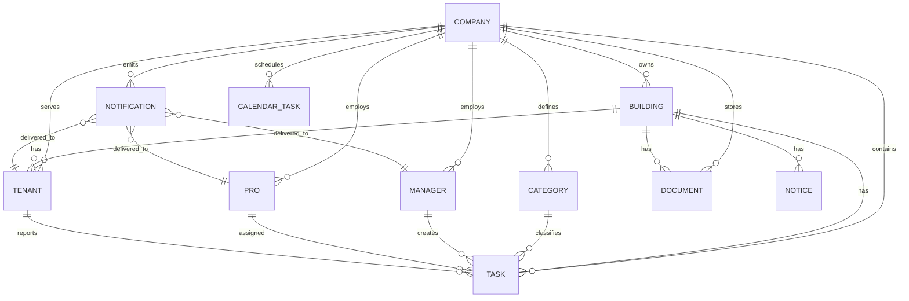

# Data Model – EBM Platform (High-Level)

## Overview
EBM is a multi-tenant SaaS platform. The primary data boundary is the **Company (tenant)**.
Most entities belong to exactly one company, and access is always scoped by `companyId`.

This document describes the **high-level domain model** and the relationships between core entities.

---

## Core Entities

### 1) Company (Tenant)
Represents a maintenance/building management organization.

**Typical responsibilities**
- Owns buildings, managers, professionals, categories, equipment, and operational settings
- Defines global configurations (notifications, preferences, etc.)

**Relationships**
- Company → many Buildings
- Company → many Managers / Bosses / Professionals
- Company → many Tasks (missions), Categories, Documents, Notifications

---

### 2) Building
Represents a residential building managed under a company.

**Typical responsibilities**
- Connects tenants, documents, notices, tasks, and equipment location
- Holds references to building-specific managers/pros (depending on your model)

**Relationships**
- Building → belongs to one Company
- Building → many Tenants (Users)
- Building → many Documents
- Building → many Tasks (missions)
- Building → many Notices
- Building → many Professionals (optional)
- Building ↔ Managers (optional, depending on assignment model)

---

### 3) Users (Tenants)
Represents end users living in a building.

**Typical responsibilities**
- Submit requests/issues
- View building notices/documents
- Receive notifications

**Relationships**
- Tenant → belongs to one Company (via Building / direct link)
- Tenant → belongs to one Building
- Tenant → can create Tasks/Requests (optional)
- Tenant → receives Notifications

---

### 4) Managers
Operational staff (maintenance managers / building managers).

**Typical responsibilities**
- Manage buildings and daily operations
- Create and assign tasks
- Review progress and reporting

**Relationships**
- Manager → belongs to one Company
- Manager ↔ Buildings (assigned buildings list)
- Manager → creates/updates Tasks
- Manager → receives Notifications

---

### 5) Professionals (Pros)
Workers/technicians that execute assigned tasks.

**Typical responsibilities**
- View assigned tasks
- Update status, add notes, upload completion evidence (if enabled)

**Relationships**
- Pro → belongs to one Company
- Pro ↔ Buildings (optional assignment)
- Pro → assigned Tasks
- Pro → receives Notifications

---

## Operational Entities

### 6) Task / Mission
Represents maintenance work items (reported issues, planned tasks, recurring jobs).

**Common fields (high-level)**
- `status` (e.g., waiting / in progress / done)
- `category`
- `buildingId`
- `companyId`
- `assignedTo` (Pro)
- `reporter` (Tenant / Manager)
- `dueDate` / scheduling info (optional)
- attachments (photos / docs) (optional)

**Relationships**
- Task → belongs to one Company
- Task → belongs to one Building
- Task → optionally created by Tenant or Manager
- Task → optionally assigned to a Pro
- Task → can generate Notifications
- Task → can be archived (history)

---

### 7) Category
Organizes tasks into types (e.g., plumbing, electricity).

**Relationships**
- Category → belongs to one Company
- Category → referenced by many Tasks

---

### 8) Document
Represents building/company documents (contracts, compliance docs, etc.).

**Common fields (high-level)**
- metadata: name, description
- file pointer/url (stored externally)
- expiry date (optional)
- visibility scope (building/company)

**Relationships**
- Document → belongs to one Company
- Document → usually belongs to one Building (or company-wide)
- Document → may trigger expiry Notifications

---

### 9) Notice / Bulletin
Building announcements and updates.

**Relationships**
- Notice → belongs to one Building
- Notice → belongs to one Company
- Notice → visible to Tenants (read-only)
- Notice → can generate Notifications (optional)

---

## Communication & Automation

### 10) Notification
Represents events delivered to users (push/in-app).

**Examples**
- new task assigned
- status changed
- document expiring soon
- calendar reminders

**Relationships**
- Notification → belongs to one Company
- Notification → belongs to one recipient (Tenant / Manager / Pro / Boss)
- Notification → may reference a related entity (taskId, documentId, etc.)

---

### 11) Calendar Task / Scheduled Item
Represents scheduled work/reminders (recurring tasks, appointments, etc.).

**Relationships**
- CalendarTask → belongs to one Company
- CalendarTask → associated to a user (manager/pro) or building
- CalendarTask → may generate Notifications
- CalendarTask → supports recurrence rules (frequency, intervals)

---

## Files / Storage Model

### Object Storage
EBM stores documents/images in external storage.

**Recommended approach**
- Store the file in object storage
- Store metadata + reference (URL/path) in MongoDB
- Enforce permissions via backend (signed URLs / protected endpoints if needed)

---

## Multi-Tenant Access Rules (Data Layer)
To enforce tenant isolation:

- Every entity includes (or derives) `companyId`
- Queries must always be filtered by `companyId`
- Cross-tenant access is denied even if an ID is known

---

## Relationship Diagram (Mermaid)

## Notes

This document intentionally describes a high-level model to avoid exposing proprietary implementation details.
Exact collections, field names, and indexes may vary between internal repositories.